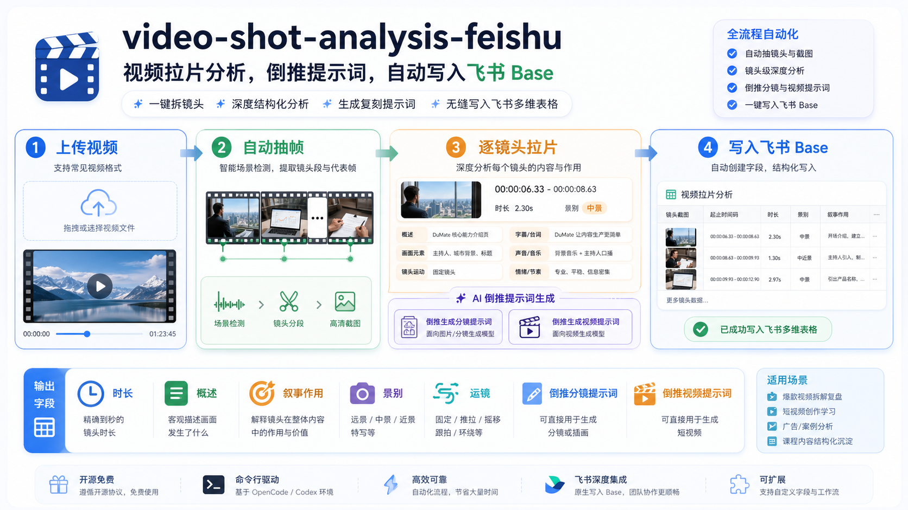

# video-shot-analysis-feishu

把一个视频拆成可复盘、可复刻、可沉淀的镜头数据库。



`video-shot-analysis-feishu` 是一个面向 Codex / OpenCode Agent 的视频拉片 skill：上传视频后，它会用 `ffmpeg` 自动抽取镜头截图和时间段，引导 Agent 逐镜头分析画面、叙事作用、景别、运镜、声音和节奏，并把结果连同截图写入飞书多维表格 Base。

更重要的是，它不只做“看懂视频”，还会倒推出两类可复刻资产：

- **生成分镜提示词**：用于生成单张分镜图、故事板或关键帧。
- **生成视频提示词**：用于即梦、Seedance、可灵、Runway 等视频模型的时间轴 prompt。

适合做短视频拆解、广告案例复盘、课程内容结构化、竞品视频学习、AI 视频工作流沉淀。

## 它解决什么问题

很多视频拉片最后都散落在截图、文档和脑子里。真正有价值的东西很难复用：

- 这个镜头为什么放在这里？
- 它承担的是开场钩子、产品信任、情绪推进，还是转场承接？
- 如果我要复刻它，应该怎么写分镜提示词？
- 如果我要让视频模型生成类似片段，时间轴 prompt 应该怎么写？
- 这些分析能不能直接沉淀到团队共享的飞书表格里？

这个 skill 把上面的流程变成一个稳定链路：**视频 → 镜头截图 → 拉片分析 → 倒推提示词 → 飞书 Base**。

## 核心功能

- 自动检测视频镜头切点，生成每个镜头的代表截图。
- 输出 `shots.json`、`shots.csv` 和可直接工作的 `analysis_prompt.md`。
- 按镜头写入飞书 Base，并把截图作为附件上传。
- 默认字段贴近真实拉片表：镜头截图、时长、概述、叙事作用、景别。
- 额外补齐 AI 视频时代更有价值的字段：运镜、转场、字幕/台词、声音/音乐、视觉风格、倒推分镜提示词、倒推视频提示词。
- 支持短视频逐镜头精拆，长视频先自动切分再按段落合并。

## 输出字段

默认建议写入飞书 Base 的字段：

| 字段 | 作用 |
| --- | --- |
| 镜头序号 | 保持视频原始顺序 |
| 镜头截图 | 每个镜头的代表画面 |
| 起止时间码 | 精确定位片段 |
| 时长 | 精确到秒的镜头长度 |
| 概述 | 画面发生了什么 |
| 叙事作用 | 这个镜头为什么存在 |
| 景别 | 远景、全景、中景、近景、特写等 |
| 画面元素 | 人物、产品、界面、道具、字幕 |
| 镜头运动 | 固定、推近、拉远、跟拍、屏幕滚动等 |
| 转场/剪辑 | 硬切、跳切、缩放、字幕承接、音频承接等 |
| 字幕/台词 | 可见文字和口播内容 |
| 声音/音乐 | BGM、音效、环境音、停顿、重音 |
| 情绪/节奏 | 镜头带来的观看感受 |
| 视觉风格 | 色彩、光影、质感、界面风格 |
| 倒推生成分镜提示词 | 面向图片/故事板模型 |
| 倒推生成视频提示词 | 面向视频生成模型 |
| 备注/置信度 | 不确定项和人工校正 |

## 安装

把仓库克隆到你的外部 skill 目录：

```bash
cd ~/.config/opencode/skills
git clone https://github.com/wocha-xiaoli/video-shot-analysis-feishu.git
```

如果你使用的是 Codex skill 目录，也可以放到：

```bash
mkdir -p ~/.codex/skills
git clone https://github.com/wocha-xiaoli/video-shot-analysis-feishu.git ~/.codex/skills/video-shot-analysis-feishu
```

## 依赖

本 skill 依赖：

- `python3`
- `ffmpeg`
- `ffprobe`
- `lark-cli`
- 已配置好的飞书/Lark 应用权限

你可以先检查：

```bash
python3 --version
ffmpeg -version
ffprobe -version
lark-cli --help
```

## 快速开始

先用脚本抽取镜头候选和代表截图：

```bash
python3 scripts/extract_shots.py ./demo.mp4 \
  --out-dir ./lapian_output \
  --threshold 0.32 \
  --min-gap 0.45
```

输出目录会包含：

```text
lapian_output/
├── analysis_prompt.md
├── shots.csv
├── shots.json
└── frames/
    ├── shot_001.jpg
    ├── shot_002.jpg
    └── ...
```

然后在 Agent 里说：

```text
使用 $video-shot-analysis-feishu 分析这个视频，把结果上传到这个飞书 Base：<你的 Base 链接或 token>
```

Agent 会按 skill 流程读取 `lark-base` 规范，创建或补齐字段，逐条写入记录，并上传每个镜头截图附件。

## 典型工作流

1. 上传视频或给出本地视频路径。
2. 自动抽取镜头段和代表截图。
3. Agent 逐镜头分析：
   - 画面发生了什么
   - 它承担什么叙事作用
   - 用了什么景别、运镜、转场
   - 声音、字幕、节奏如何配合
4. 倒推两类 prompt：
   - 分镜/关键帧生成 prompt
   - 视频生成 prompt
5. 写入飞书 Base，形成可检索、可复盘、可复用的视频案例库。

## 参数建议

`extract_shots.py` 常用参数：

| 参数 | 默认值 | 说明 |
| --- | --- | --- |
| `--threshold` | `0.32` | 场景变化检测阈值，越高切得越少 |
| `--min-gap` | `0.45` | 两个镜头切点之间的最短间隔 |
| `--fallback-interval` | `2.0` | 没检测到切点时按固定间隔补采样 |
| `--max-shots` | `160` | 最大镜头数，避免长视频爆量 |
| `--width` | `720` | 截图宽度，兼顾清晰度和飞书附件体积 |

如果切得太碎：

```bash
python3 scripts/extract_shots.py ./demo.mp4 --threshold 0.42 --min-gap 0.8
```

如果漏切明显：

```bash
python3 scripts/extract_shots.py ./demo.mp4 --threshold 0.22 --min-gap 0.3
```

## 飞书 Base 注意事项

- 截图字段必须是附件字段。
- 附件上传必须走 `lark-cli base +record-upload-attachment`。
- 写入前先用 `+field-list` 读取真实字段结构，避免重复建字段。
- 如果用户给的是 `/wiki/` 链接，要先解析真实 `obj_token`，再作为 Base token 使用。
- 普通飞书电子表格不适合存镜头附件和单选标签，默认优先用多维表格 Base。

## 开源协议

MIT License。欢迎 fork、改字段、改 prompt、接入你自己的视频生成工具链。

如果你用它搭出了一个好用的视频案例库，欢迎给这个仓库一个 star。
